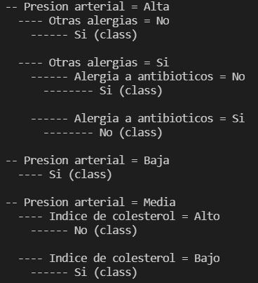

# Aprendizaje ID3

Assumptions about the datasets:
- The variables are discrete and composed of a set of labels.
- The decision variable is in the last column.
- The tree is capable of classifying in more than 2 classes.
- The missing or unlabeled values are not considered (will be treated as a different label ?).

##### Project steps

1. CVS file processing
2. Generating a tree
    - entropy
    - gain
3. Prediction
4. Visual presentation of the tree
5. Performance improvements
    - better build time
    - better clasification

##### Visual representation

Example for the tree based on the dataset seen in class ('data/farmaco.csv').

##### Modifications

- The split attribute  in each node is the one with biggest gain.
    - If gains for all attributes equal 0 a random value is chosen.
    - A 90% chance that the best split attribute is chosen in each node (`mutate=True`)
- A node is marked as leaf if:
    - There's no more attributes for split.
    - The data represents only one class.
    - 80% of data represents one class (`early_stop=True`)

##### Tests
Performed mostly on chess dataset.
Compare the time for building the original and modified trees and their accuracies.

##### Datasets
- Chess dataset (36 attributes, 3196 instances, 2 classes) https://archive.ics.uci.edu/ml/datasets/Chess+%28King-Rook+vs.+King-Pawn%29
- Mushroom dataset (22 attributes, 8124 instances, 2 classes) https://archive.ics.uci.edu/ml/datasets/Mushroom
- Connect 4 dataset (42 attributes, 67557 instances, 3 classes) https://archive.ics.uci.edu/ml/datasets/Connect-4
- Example dataset from class (5 attributes, 14 instances, 2 classes)

The Connect 4 dataset is too big for good performance with this model - the tree would grow too much. Attempts were made to implement a Random Forest that would sample the dataset (by both rows and columns) and build smaller trees. No tests were performed as that model was also too costly. There are libraries who implement them more efficiently.